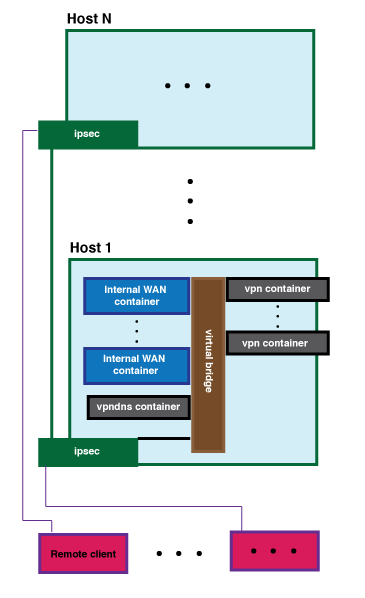
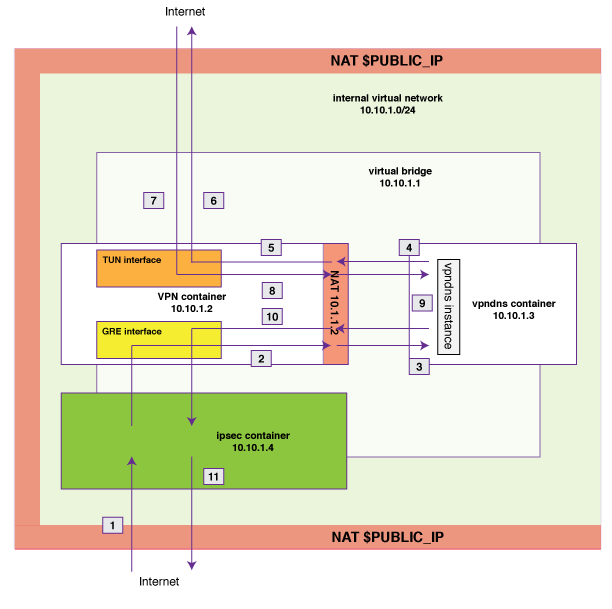

# vpndns
### "VPN core" architecture with "vpndns" DNS proxy

This repository, a work in progress, describes an IPsec-secured WAN configuration
which provides clients access to, among other things,
multiple distinct routes out to the Internet
using retail VPN connections. 
A centralized DNS proxy server for use in this context is also implemented, 
supporting static `A` records, blocklists, and a policy-based proxy configuration 
that forwards requests based on client address. 
This allows clients to query
a specific, statically configured resolver which forwards DNS requests appropriately,
instead of requiring dynamic resolver configuration based on the state of the
VPN connection.

Throughout, the term `VPN` is intended to refer to a connection through which
Internet access is made available, generally as a commercially available service.
In other words, it corresponds to the "mass-market" usage of the term VPN as
a way to access the Internet.

Hosts and mobile clients are connected together in a wide-area `IPsec` tunnel 
topology, with each host housing its own internal virtual network. 
But this same 
guide/description is also applicable in a setup where a protocol other than IPsec
is used to connect the hosts, such as Wireguard.

This document and repository are designed to give a general description of this
setup, and also to assist anyone working on a similar setup.

### WAN overview

At a high level, the components of the system are the following:

* Hosts: physical or virtual servers connected to the Internet, to be connected
via site-to-site tunnels to form an IPsec WAN/IP overlay network, with each host
having an internal virtual network, typically a `/24`
* Containers, each having its own IP address on a host's internal virtual network; 
each container has its own virtual network stack
(using a Linux network namespace or FreeBSD VNET setting), as if it were a 
separate machine on the LAN represented by the host's virtual network
* Clients, which can each either be a container on some host, or an Internet-connected
device such as laptop or mobile phone capable of dialing into the network directly.
Clients are just those things which, roughly, act as clients to a host's 
containers in some way. 

Containers can be categorized as follows:

* Internal/WAN services: services which are not necessarily connected to the Internet but
which are accessible across the WAN (labeled "Internal WAN container" above).
* VPN containers: providing Internet connectivity to clients via an external
VPN connection, such as OpenVPN or Wireguard. 
* IPsec container: each host has a unique IPsec container which connects the
host's internal network to other hosts via site-to-site IPsec tunnels. 
 * The IPsec container, with its own virtual network stack like any other container,
acts as a router for the host and its containers: packets to and from remote
sites pass through the container in both directions.
* vpndns container: each host as a unique vpndns container, 
running a vpndns instance, which forwards DNS
requests (originating from that host or from elsewhere) to VPN containers on 
that host, based on policy.
It also supports other functionality - see below.
* Other containers: whatever other containers the host might have.

### IPsec container configuration

As described above, the IPsec container links a host's internal network to the
internal networks of the other hosts, as well as to individual clients.
 Since it's a container, with an IP 
address on the host's network like any other container, it's not actually
directly connected to the Internet. NAT needs to be configured on the host,
forwarding UDP ports `500` and `4500` (assuming IPv4). 

Either a policy-based or a route-based IPsec configuration is possible. In the 
policy-based configuration, inbound and outbound packets are seamlessly 
processed into/out of the IPsec tunnel, without the involvement of an interface
or any routes. The route-based configuration (which technically also involves
a policy), defines the policy relative to an interface, making it possible to
use routes (including setting MTUs) and view IPsec-processed packets with `tcpdump`
and similar tools.
For this reason it is more commonly used, and it's the approach we take here.

The operating system's IPsec state (such as keys) can be configured statically,  
but this should generally only be done for testing. For a real deployment, an 
IKE daemon should run on both ends of the tunnel to keep state synchronized and
ensure that keys remain secure over time. StrongSwan is an excellent IKE 
software with good documentation. This repository includes a basic static
configuration for FreeBSD as well as an example StrongSwan `swanctl.conf`.

Further discussion of options on Linux, and the rest of the StrongSwan
documentation, can be found here:
 
[https://docs.strongswan.org/docs/5.9/features/routeBasedVpn.html]
(https://docs.strongswan.org/docs/5.9/features/routeBasedVpn.html)

#### High availability: WAN / inter-host

BGP (FRR)

### VPN configuration

#### TODO

#### High availability: VPN endpoint / connection

When a client is accessing the Internet through a VPN container, we consider
three forms of failure:

1. Failure of a link between hosts: this should be entirely addressed by redundant
links between hosts and BGP, as described above
2. Failure of the VPN container's configuration (e.g. VPN provider availability 
issue)
3. Other failure of the host or container which makes the container entirely 
inaccessible (e.g. host crashes, datacenter loses connectivity or power)

Failures 2 and 3 need to be addressed by making the VPN container accessible on
another host, but this failover will not be seamless unless the remote side of 
the VPN (the server)
coordinates to maintain the public IP address 

#### Client access options

Different types of clients will have different capabilities as far as setting
their default route to 

#### the vpndns server (central DNS proxy)
  
The diagram below, and the notes that follow, describe in detail the process of DNS resolution, regardless of whether clients have
any routes through the VPN containers.

  

  

1. Incoming DNS request (UDP) encapsulated in GRE over IPsec (tunnel mode)
2. First the ipsec container decapsulates IPsec and forwards to the GRE interface on the VPN container (via virtual bridge).  
The VPN container routes the underlying DNS request to the vpndns container;
the source address is translated to 10.10.1.2, the VPN container's own address on the bridge, with NAT.
3. vpndns instance listening on UDP port 53 receives the DNS request, applies processing (such as blocklist lookup),
and looks up the forwarder (i.e. DNS server to service the request with) based on the source address (10.10.1.2).   
In the standard configuration, the source -> forwarder map is an identity for VPN containers.
4. Therefore, the vpndns container sends the DNS request back into the VPN container (to resolve the request using that 
VPN container's remote endpoint's DNS server)
5. NAT on the VPN container is configured with port forwarding, to redirect incoming UDP on port 53 
to the external VPN's remote endpoint on the TUN interface (which is configured at tunnel setup time), or whatever
other DNS server address has been provided by the external VPN service.  
Due to this NAT, the vpndns instance is not aware of the possibly dynamically configured address of the DNS server
used by the VPN container.  
This also allows other clients to query DNS using this container's external VPN connection by just sending their requests to the container's
address on the bridge.  
Note that the lookup table used for this NAT instance is distinct from the one used in (2).
6. The VPN software on 10.10.1.2, attached to the TUN interface, sends the DNS request through the external VPN connection,
e.g. OpenVPN
7. The response is received, decapsulated, and inserted into the TUN interface 
by the VPN connection (e.g. OpenVPN)
8. The underlying UDP DNS response is routed from the TUN interface out through NAT to the vpndns instance; 
due to the existing NAT table entry from the port forward, this response is originating from 
10.10.1.2 from the standpoint of the vpndns instance.
9. The vpndns instance examines the response to determine which client to sent it to.   
It finds that the client is 10.10.1.2, and the DNS response UDP datagram is sent to 10.10.1.2.
The VPN container's NAT table (from step (2)) translates the destination address to the original remote client.
10. The response is routed to the original remote client  
The VPN container's routing table has an entry for the remote client, through the remote end of the GRE tunnel.
11. The ipsec container encapsulates the GRE packet in the IPsec tunnel.

### Internal/WAN services

This configuration makes it easy to make a number of services accessible to 
clients from anywhere. One advantage is that, setting aside security concerns 
that arise from within the WAN itself, services that are accessible on the WAN
generally do not need the level of security as they would if they were 
Internet-facing. Essentially, as far as the WAN services are concerned, 
all Internet-facing 
security considerations are taken care of at once by IPsec.

The reality is inevitably more complex when multiple users are involved and when
certain services are more trusted than others, especially when it comes to services
which access the Internet. Threats can also arise from within the WAN.
Firewalls/ACLs on the host can go a long way in this 
context.

Examples of internal/WAN services include:

* SMTP/IMAP servers: multi-user communication, system monitoring/alerting/logging,
general remote storage of small documents, e.g. sharing URL from a mobile phone
web browser to consult later
* XMPP: secure communication; no need to back up chat transcripts when the instance
already stores them locally
* Virtual desktops: containers running a VNC server; this benefits from 
local access to the host's storage and services, and the ability to maintain 
long-running desktop state (e.g. open windows/work flow), so long as the host is 
running.
 * Virtual desktops are an example of a container which would benefit from using a
VPN container for its Internet connection, typically via GRE. "Blank-slate" 
Internet-enabled virtual desktops are an ongoing area of work already for
privacy, convenience, and productivity reasons, e.g. Kasmweb and others.
* Web servers, file servers (SMB, sshfs, user-space NFS)
* Media servers: such as Subsonic-compatible Java-based music servers; other popular
options Kodi and Plex require additional configuration on the hosts to support
multicast routing
* Podcast/RSS ingestion and local redistribution/aggregation (e.g. gPodder, TT-RSS)
* HDHomeRun and similar: export local radio-based TV over the WAN to remote clients (also requires
multicast to be configured)

### Container setup: FreeBSD
